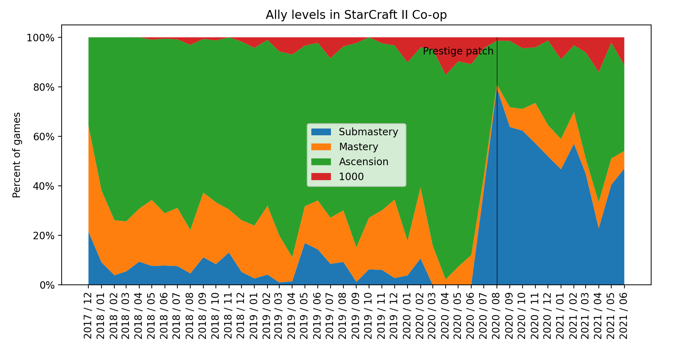
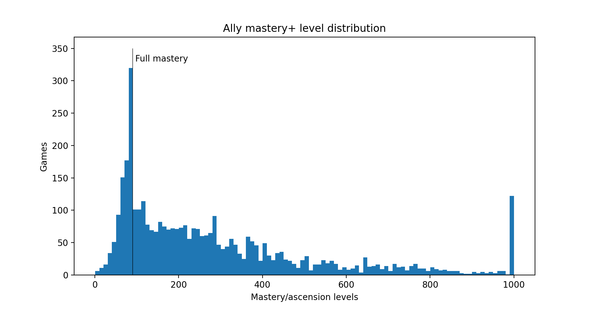

# Analysis ally levels in StarCraft II Co-op

First the percentage of games where the ally was  on submastery, mastery, prestige leveling or at max prestige (1000).

The prestige patch (5.0.0) clearly increased the number of players playing on submastery.

And the total amount of games sorted based on the ally level.

The spike near full mastery is due to much higher amount of experience required between 89-90 than 90-91.

# Data

Data is collected from my replays. Common partners in custom games were excluded not to include additional bias. The vast majority (>90%) replays are from NA server.

Replay parser script not included. But can be found [here](https://github.com/FluffyMaguro/SC2_Coop_overlay/blob/master/SCOFunctions/S2Parser.py).